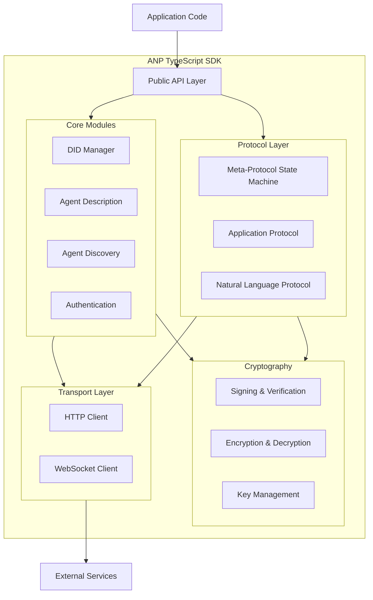
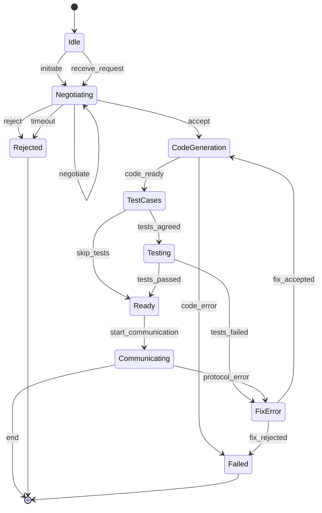

# Design Document

## Overview

The ANP TypeScript SDK provides a comprehensive implementation of the Agent Network Protocol, enabling developers to build intelligent agents that can authenticate, discover, and communicate with other agents in a decentralized network. The SDK leverages XState v5 for robust state machine management, ensuring predictable protocol flows and state transitions.

The SDK is designed with modularity, extensibility, and developer experience in mind. It provides high-level APIs for common operations while allowing low-level access for advanced use cases.

**IMPORTANT**: All SDK code MUST be developed in the `ts_sdk` directory at the root of the project. This directory structure ensures clear separation from the protocol specifications and examples.

### Project Structure

```
ts_sdk/
├── src/                    # Source code
│   ├── core/              # Core modules (DID, Auth, ADP, Discovery)
│   ├── protocol/          # Protocol layer (Meta-protocol, Message Handler)
│   ├── crypto/            # Cryptography module
│   ├── transport/         # Transport layer (HTTP, WebSocket)
│   ├── types/             # TypeScript type definitions
│   ├── errors/            # Error classes
│   └── index.ts           # Public API entry point
├── tests/                 # Test files
│   ├── unit/             # Unit tests
│   └── integration/      # Integration tests
├── examples/             # Example applications
├── docs/                 # Documentation
├── package.json          # Package configuration
├── tsconfig.json         # TypeScript configuration
├── vitest.config.ts      # Vitest configuration
└── README.md             # SDK documentation
```

## Architecture

### High-Level Architecture



### Module Dependencies

- **Public API Layer**: Entry point for developers, provides simplified interfaces
- **Core Modules**: Business logic for DID, ADP, Discovery, and Authentication
- **Protocol Layer**: State machines and handlers for protocol negotiation and communication
- **Cryptography**: Low-level cryptographic operations
- **Transport Layer**: HTTP and WebSocket clients for network communication

## Components and Interfaces

### 1. DID Manager

**Purpose**: Manage DID:WBA identities, including creation, resolution, and key management.

**Key Classes**:

```typescript
interface DIDDocument {
  '@context': string[];
  id: string;
  verificationMethod: VerificationMethod[];
  authentication: (string | VerificationMethod)[];
  keyAgreement?: VerificationMethod[];
  humanAuthorization?: (string | VerificationMethod)[];
  service?: ServiceEndpoint[];
}

interface VerificationMethod {
  id: string;
  type: string;
  controller: string;
  publicKeyJwk?: JsonWebKey;
  publicKeyMultibase?: string;
}

class DIDManager {
  // Create a new DID identity
  async createDID(domain: string, path?: string): Promise<DIDIdentity>
  
  // Resolve a DID to its document
  async resolveDID(did: string): Promise<DIDDocument>
  
  // Sign data with a DID identity
  async sign(identity: DIDIdentity, data: Uint8Array): Promise<Signature>
  
  // Verify a signature
  async verify(did: string, data: Uint8Array, signature: Signature): Promise<boolean>
  
  // Export DID document
  exportDocument(identity: DIDIdentity): DIDDocument
}

interface DIDIdentity {
  did: string;
  document: DIDDocument;
  privateKeys: Map<string, CryptoKey>;
}
```

### 2. Authentication Manager

**Purpose**: Handle HTTP authentication using DID:WBA method.

**Key Classes**:

```typescript
interface AuthConfig {
  maxTokenAge: number; // milliseconds
  nonceLength: number;
  clockSkewTolerance: number; // seconds
}

class AuthenticationManager {
  constructor(
    private didManager: DIDManager,
    private config: AuthConfig
  ) {}
  
  // Generate authentication header for outgoing request
  async generateAuthHeader(
    identity: DIDIdentity,
    targetDomain: string,
    verificationMethodId: string
  ): Promise<string>
  
  // Verify incoming request authentication
  async verifyAuthHeader(
    authHeader: string,
    expectedDomain: string
  ): Promise<VerificationResult>
  
  // Generate access token after successful authentication
  generateAccessToken(did: string, expiresIn: number): string
  
  // Verify access token
  verifyAccessToken(token: string): TokenVerificationResult
}

interface VerificationResult {
  success: boolean;
  did?: string;
  error?: string;
}
```

### 3. Agent Description Manager

**Purpose**: Create, publish, and parse agent description documents.

**Key Classes**:

```typescript
interface AgentDescription {
  protocolType: 'ANP';
  protocolVersion: string;
  type: 'AgentDescription';
  url?: string;
  name: string;
  did?: string;
  owner?: Organization;
  description?: string;
  created?: string;
  securityDefinitions: Record<string, SecurityScheme>;
  security: string;
  Infomations?: Information[];
  interfaces?: Interface[];
  proof?: Proof;
}

class AgentDescriptionManager {
  // Create a new agent description
  createDescription(metadata: AgentMetadata): AgentDescription
  
  // Add information resource
  addInformation(
    description: AgentDescription,
    info: Information
  ): AgentDescription
  
  // Add interface
  addInterface(
    description: AgentDescription,
    iface: Interface
  ): AgentDescription
  
  // Sign agent description
  async signDescription(
    description: AgentDescription,
    identity: DIDIdentity,
    challenge: string
  ): Promise<AgentDescription>
  
  // Fetch and parse agent description
  async fetchDescription(url: string): Promise<AgentDescription>
  
  // Verify agent description signature
  async verifyDescription(description: AgentDescription): Promise<boolean>
}
```

### 4. Agent Discovery Manager

**Purpose**: Discover agents through active and passive mechanisms.

**Key Classes**:

```typescript
interface DiscoveryDocument {
  '@context': Record<string, string>;
  '@type': 'CollectionPage';
  url: string;
  items: AgentDescriptionItem[];
  next?: string;
}

interface AgentDescriptionItem {
  '@type': 'ad:AgentDescription';
  name: string;
  '@id': string; // URL to agent description
}

class AgentDiscoveryManager {
  // Active discovery: fetch agents from a domain
  async discoverAgents(domain: string): Promise<AgentDescriptionItem[]>
  
  // Passive discovery: register with a search service
  async registerWithSearchService(
    searchServiceUrl: string,
    agentDescriptionUrl: string,
    identity: DIDIdentity
  ): Promise<void>
  
  // Search for agents
  async searchAgents(
    searchServiceUrl: string,
    query: SearchQuery
  ): Promise<AgentDescriptionItem[]>
  
  // Fetch all pages recursively
  private async fetchAllPages(url: string): Promise<AgentDescriptionItem[]>
}
```

### 5. Meta-Protocol State Machine

**Purpose**: Manage protocol negotiation flow using XState v5.

**State Machine Design**:



**Key Classes**:

```typescript
interface MetaProtocolContext {
  sequenceId: number;
  candidateProtocols: string;
  agreedProtocol?: string;
  testCases?: string;
  maxNegotiationRounds: number;
  remoteDID: string;
  localIdentity: DIDIdentity;
}

type MetaProtocolEvent =
  | { type: 'initiate'; remoteDID: string; candidateProtocols: string }
  | { type: 'receive_request'; message: ProtocolNegotiationMessage }
  | { type: 'negotiate'; response: string }
  | { type: 'accept' }
  | { type: 'reject'; reason: string }
  | { type: 'code_ready' }
  | { type: 'code_error'; error: string }
  | { type: 'tests_agreed'; testCases: string }
  | { type: 'skip_tests' }
  | { type: 'tests_passed' }
  | { type: 'tests_failed'; errors: string }
  | { type: 'fix_accepted' }
  | { type: 'fix_rejected' }
  | { type: 'start_communication' }
  | { type: 'protocol_error'; error: string }
  | { type: 'end' };

class MetaProtocolMachine {
  // Create state machine instance
  static create(config: MetaProtocolConfig): Actor<MetaProtocolMachine>
  
  // Send negotiation message
  async sendNegotiation(
    actor: Actor,
    candidateProtocols: string,
    modificationSummary?: string
  ): Promise<void>
  
  // Process received message
  async processMessage(
    actor: Actor,
    message: MetaProtocolMessage
  ): Promise<void>
}
```

### 6. Protocol Message Handler

**Purpose**: Encode and decode protocol messages.

**Key Classes**:

```typescript
enum ProtocolType {
  META = 0b00,
  APPLICATION = 0b01,
  NATURAL_LANGUAGE = 0b10,
  VERIFICATION = 0b11
}

interface ProtocolMessage {
  protocolType: ProtocolType;
  data: Uint8Array;
}

class ProtocolMessageHandler {
  // Encode message
  encode(type: ProtocolType, data: Uint8Array): Uint8Array
  
  // Decode message
  decode(message: Uint8Array): ProtocolMessage
  
  // Parse meta-protocol message
  parseMetaProtocol(data: Uint8Array): MetaProtocolMessage
  
  // Parse application protocol message
  parseApplicationProtocol(data: Uint8Array): any
  
  // Parse natural language message
  parseNaturalLanguage(data: Uint8Array): string
}

type MetaProtocolMessage =
  | ProtocolNegotiationMessage
  | CodeGenerationMessage
  | TestCasesNegotiationMessage
  | FixErrorNegotiationMessage
  | NaturalLanguageNegotiationMessage;

interface ProtocolNegotiationMessage {
  action: 'protocolNegotiation';
  sequenceId: number;
  candidateProtocols: string;
  modificationSummary?: string;
  status: 'negotiating' | 'rejected' | 'accepted' | 'timeout';
}
```

### 7. Cryptography Module

**Purpose**: Provide cryptographic operations for signing, verification, and encryption.

**Key Classes**:

```typescript
class CryptoModule {
  // Generate key pair
  async generateKeyPair(type: KeyType): Promise<CryptoKeyPair>
  
  // Sign data
  async sign(privateKey: CryptoKey, data: Uint8Array): Promise<Uint8Array>
  
  // Verify signature
  async verify(
    publicKey: CryptoKey,
    data: Uint8Array,
    signature: Uint8Array
  ): Promise<boolean>
  
  // ECDHE key exchange
  async performKeyExchange(
    localPrivateKey: CryptoKey,
    remotePublicKey: CryptoKey
  ): Promise<Uint8Array>
  
  // Derive encryption key
  async deriveKey(sharedSecret: Uint8Array, salt: Uint8Array): Promise<CryptoKey>
  
  // Encrypt data
  async encrypt(key: CryptoKey, data: Uint8Array): Promise<EncryptedData>
  
  // Decrypt data
  async decrypt(key: CryptoKey, encrypted: EncryptedData): Promise<Uint8Array>
}

enum KeyType {
  ECDSA_SECP256K1 = 'EcdsaSecp256k1VerificationKey2019',
  ED25519 = 'Ed25519VerificationKey2020',
  X25519 = 'X25519KeyAgreementKey2019'
}

interface EncryptedData {
  ciphertext: Uint8Array;
  iv: Uint8Array;
  tag: Uint8Array;
}
```

### 8. HTTP Client

**Purpose**: Handle HTTP requests with authentication and error handling.

**Key Classes**:

```typescript
interface HTTPClientConfig {
  timeout: number;
  maxRetries: number;
  retryDelay: number;
}

class HTTPClient {
  constructor(
    private authManager: AuthenticationManager,
    private config: HTTPClientConfig
  ) {}
  
  // Make authenticated request
  async request(
    url: string,
    options: RequestOptions,
    identity?: DIDIdentity
  ): Promise<Response>
  
  // GET request
  async get(url: string, identity?: DIDIdentity): Promise<Response>
  
  // POST request
  async post(
    url: string,
    body: any,
    identity?: DIDIdentity
  ): Promise<Response>
  
  // Retry with exponential backoff
  private async retryWithBackoff<T>(
    fn: () => Promise<T>,
    retries: number
  ): Promise<T>
}
```

### 9. Public API

**Purpose**: Provide high-level, developer-friendly API.

**Key Classes**:

```typescript
interface ANPConfig {
  did?: {
    resolver?: DIDResolver;
  };
  auth?: AuthConfig;
  http?: HTTPClientConfig;
  crypto?: CryptoConfig;
  debug?: boolean;
}

class ANPClient {
  constructor(config?: ANPConfig)
  
  // DID operations
  readonly did: {
    create(domain: string, path?: string): Promise<DIDIdentity>;
    resolve(did: string): Promise<DIDDocument>;
    sign(identity: DIDIdentity, data: Uint8Array): Promise<Signature>;
    verify(did: string, data: Uint8Array, signature: Signature): Promise<boolean>;
  };
  
  // Agent description operations
  readonly agent: {
    createDescription(metadata: AgentMetadata): AgentDescription;
    addInformation(description: AgentDescription, info: Information): AgentDescription;
    addInterface(description: AgentDescription, iface: Interface): AgentDescription;
    signDescription(description: AgentDescription, identity: DIDIdentity, challenge: string): Promise<AgentDescription>;
    fetchDescription(url: string): Promise<AgentDescription>;
  };
  
  // Discovery operations
  readonly discovery: {
    discoverAgents(domain: string): Promise<AgentDescriptionItem[]>;
    registerWithSearchService(searchServiceUrl: string, agentDescriptionUrl: string, identity: DIDIdentity): Promise<void>;
    searchAgents(searchServiceUrl: string, query: SearchQuery): Promise<AgentDescriptionItem[]>;
  };
  
  // Protocol operations
  readonly protocol: {
    createNegotiationMachine(config: MetaProtocolConfig): Actor;
    sendMessage(remoteDID: string, message: any, identity: DIDIdentity): Promise<void>;
    receiveMessage(encryptedMessage: Uint8Array, identity: DIDIdentity): Promise<any>;
  };
  
  // HTTP operations
  readonly http: {
    request(url: string, options: RequestOptions, identity?: DIDIdentity): Promise<Response>;
    get(url: string, identity?: DIDIdentity): Promise<Response>;
    post(url: string, body: any, identity?: DIDIdentity): Promise<Response>;
  };
}
```

## Data Models

### DID Document

```typescript
interface DIDDocument {
  '@context': string[];
  id: string;
  verificationMethod: VerificationMethod[];
  authentication: (string | VerificationMethod)[];
  keyAgreement?: VerificationMethod[];
  humanAuthorization?: (string | VerificationMethod)[];
  service?: ServiceEndpoint[];
}
```

### Agent Description

```typescript
interface AgentDescription {
  protocolType: 'ANP';
  protocolVersion: string;
  type: 'AgentDescription';
  url?: string;
  name: string;
  did?: string;
  owner?: Organization;
  description?: string;
  created?: string;
  securityDefinitions: Record<string, SecurityScheme>;
  security: string;
  Infomations?: Information[];
  interfaces?: Interface[];
  proof?: Proof;
}
```

### Protocol Messages

```typescript
interface ProtocolNegotiationMessage {
  action: 'protocolNegotiation';
  sequenceId: number;
  candidateProtocols: string;
  modificationSummary?: string;
  status: 'negotiating' | 'rejected' | 'accepted' | 'timeout';
}

interface CodeGenerationMessage {
  action: 'codeGeneration';
  status: 'generated' | 'error';
}

interface TestCasesNegotiationMessage {
  action: 'testCasesNegotiation';
  testCases: string;
  modificationSummary?: string;
  status: 'negotiating' | 'rejected' | 'accepted';
}
```

## Error Handling

### Error Hierarchy

```typescript
class ANPError extends Error {
  constructor(message: string, public code: string) {
    super(message);
    this.name = 'ANPError';
  }
}

class DIDResolutionError extends ANPError {
  constructor(did: string, cause?: Error) {
    super(`Failed to resolve DID: ${did}`, 'DID_RESOLUTION_ERROR');
    this.cause = cause;
  }
}

class AuthenticationError extends ANPError {
  constructor(message: string) {
    super(message, 'AUTHENTICATION_ERROR');
  }
}

class ProtocolNegotiationError extends ANPError {
  constructor(message: string) {
    super(message, 'PROTOCOL_NEGOTIATION_ERROR');
  }
}

class NetworkError extends ANPError {
  constructor(message: string, public statusCode?: number) {
    super(message, 'NETWORK_ERROR');
  }
}

class CryptoError extends ANPError {
  constructor(message: string) {
    super(message, 'CRYPTO_ERROR');
  }
}
```

### Error Handling Strategy

1. **Network Errors**: Retry with exponential backoff (configurable)
2. **Authentication Errors**: Return immediately, no retry
3. **DID Resolution Errors**: Cache negative results temporarily, retry after timeout
4. **Protocol Errors**: Attempt error negotiation, fallback to rejection
5. **Crypto Errors**: Return immediately, log for debugging

## Testing Strategy

### Unit Tests

Each module will have comprehensive unit tests covering:

1. **DID Manager**:
   - Key pair generation
   - DID document creation
   - DID resolution (mocked HTTP)
   - Signing and verification
   - Error cases (invalid DIDs, network failures)

2. **Authentication Manager**:
   - Auth header generation
   - Auth header verification
   - Token generation and validation
   - Nonce uniqueness
   - Timestamp validation
   - Error cases (expired tokens, invalid signatures)

3. **Agent Description Manager**:
   - Description creation
   - Information and interface addition
   - Signature generation and verification
   - JSON-LD parsing
   - Error cases (invalid documents, signature mismatches)

4. **Agent Discovery Manager**:
   - Active discovery
   - Pagination handling
   - Passive registration
   - Search functionality
   - Error cases (404, malformed documents)

5. **Meta-Protocol State Machine**:
   - All state transitions
   - Message handling
   - Timeout handling
   - Error recovery
   - Edge cases (max rounds, invalid messages)

6. **Protocol Message Handler**:
   - Message encoding/decoding
   - Protocol type handling
   - Binary format correctness
   - Error cases (malformed messages)

7. **Cryptography Module**:
   - Key generation
   - Signing and verification
   - ECDHE key exchange
   - Encryption and decryption
   - Error cases (invalid keys, corrupted data)

### Integration Tests

Integration tests will cover:

1. **End-to-End Authentication Flow**:
   - Create two DID identities
   - Perform HTTP authentication
   - Verify token exchange
   - Make authenticated requests

2. **Agent Discovery Flow**:
   - Publish agent description
   - Discover agents from domain
   - Register with search service
   - Search for agents

3. **Protocol Negotiation Flow**:
   - Initiate negotiation
   - Exchange multiple rounds
   - Reach agreement
   - Generate code
   - Execute tests
   - Communicate with agreed protocol

4. **Encrypted Communication**:
   - Establish encrypted channel
   - Send encrypted messages
   - Receive and decrypt messages
   - Verify end-to-end encryption

### Test Infrastructure

- **Test Framework**: Vitest
- **Mocking**: Vitest mocks for HTTP requests
- **Coverage**: Istanbul/c8 for code coverage
- **CI/CD**: GitHub Actions for automated testing
- **Test Data**: Fixtures for DID documents, agent descriptions, protocol messages

### Test-Driven Development Workflow

**CRITICAL: All development MUST follow strict TDD principles:**

1. **RED**: Write failing unit test for new feature BEFORE any implementation
2. **GREEN**: Implement MINIMAL code to pass the test
3. **REFACTOR**: Improve code while keeping tests green
4. **EDGE CASES**: Add tests for edge cases and error conditions
5. **VERIFY**: Ensure all tests pass before moving to next task
6. **COVERAGE**: Maintain 80%+ code coverage at all times
7. **INTEGRATION**: Run integration tests after completing related units

**Development Rules**:
- NO implementation code without a failing test first
- ALL unit tests MUST pass before proceeding to next task
- Integration tests MUST pass before considering a feature complete
- Tests are documentation - write clear, descriptive test names
- Mock external dependencies in unit tests
- Use real implementations in integration tests

## Performance Considerations

1. **DID Resolution Caching**: Cache resolved DID documents with TTL
2. **Connection Pooling**: Reuse HTTP connections
3. **Lazy Loading**: Load modules on demand
4. **Streaming**: Support streaming for large payloads
5. **Worker Threads**: Offload crypto operations to workers (optional)

## Security Considerations

1. **Key Storage**: Never store private keys in plain text
2. **Nonce Generation**: Use cryptographically secure random generator
3. **Signature Verification**: Always verify signatures before processing
4. **Token Expiration**: Enforce token expiration
5. **Rate Limiting**: Implement rate limiting for outgoing requests
6. **Input Validation**: Validate all inputs against schemas
7. **Secure Defaults**: Use secure defaults for all configurations

## Deployment and Distribution

1. **Package Manager**: Publish to npm
2. **Module Formats**: ESM and CommonJS
3. **TypeScript**: Include type definitions
4. **Documentation**: Generate API docs with TypeDoc
5. **Examples**: Provide example applications
6. **Versioning**: Follow semantic versioning

## Future Enhancements

1. **WebSocket Support**: Real-time bidirectional communication
2. **Plugin System**: Allow third-party extensions
3. **AI Integration**: Built-in LLM integration for protocol negotiation
4. **Monitoring**: Built-in telemetry and monitoring
5. **Multi-DID**: Support multiple DID identities per client
6. **Browser Support**: Full browser compatibility with Web Crypto API
